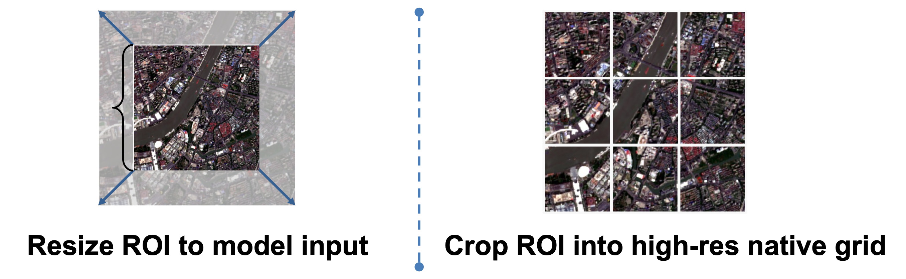
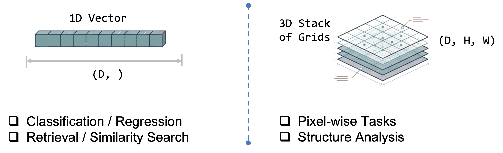

# Before You Start: Understand Settings

Read this page before you start your project.

In `rs-embed`, knobs such as `input_prep`, `fetch.scale_m`, temporal window, model `variant`, image size, patch size, and frame count directly change what information reaches the model and how expensive inference becomes.

More compute can buy better spatial detail, stronger temporal context, or higher-capacity backbones, but it can also change embedding semantics. That means setting choices affect both quality and comparability.

---

## Start With This Rule

1. Start from the model defaults.
2. Change one setting family at a time.
3. Treat every setting change as part of experiment design, not just performance tuning.
4. Record the exact settings you used before comparing results across runs or models.

!!! warning "Important"
    A more expensive setting is not automatically a better setting.
    It is only better if it matches your task.

    For example, `input_prep="tile"` is usually better for preserving spatial structure on large ROIs, but it is slower than `"resize"`. A smaller patch size may expose finer detail, but it also increases token count and memory use. A longer temporal window may stabilize seasonal signals, but it no longer represents one narrow acquisition moment.

---

## The Settings That Matter Most

| Setting family | Common examples | What it usually changes | Typical tradeoff |
| -------------- | --------------- | ----------------------- | ---------------- |
| source sampling | `fetch=FetchSpec(scale_m=10, composite="median")` | source resolution, compositing behavior, scene content | more detail or stricter sampling usually means more data movement and sometimes less robustness |
| temporal scope | `TemporalSpec.range(...)`, `TemporalSpec.year(...)` | whether the embedding summarizes one short window, one season, or one annual product | longer windows can be more stable, but less scene-specific |
| API input policy | `input_prep="resize"` or `input_prep="tile"` | whether a large ROI is compressed once or processed in tiles | tiling preserves more spatial detail, but costs more runtime |
| output mode | `OutputSpec.pooled()` or `OutputSpec.grid()` | ROI-level vector vs model-space spatial field | `pooled` is easier to compare and store; `grid` preserves spatial structure but produces larger outputs |
| model capacity | `variant="tiny"`, `"base"`, `"large"` | backbone size and representation capacity | larger variants usually cost more memory and latency |
| image size | model-specific `..._IMG` env vars | how much spatial detail is retained before inference | larger inputs usually improve detail but grow compute quickly |
| patch size | model-specific `..._PATCH` env vars | token density and grid granularity | smaller patches give denser tokens but raise cost |
| frame count | `RS_EMBED_ANYSAT_FRAMES`, `RS_EMBED_GALILEO_FRAMES` | temporal fidelity for sequence models | more frames increase temporal detail and runtime together |

---

## Choose Settings By Need

### `input_prep="resize"` vs `input_prep="tile"`



This is one of the most important public settings.
The public API name is `input_prep`, not `input_pre`.

Use `input_prep="resize"` when:

- you want the fastest path
- you only need one ROI-level embedding
- the ROI is moderate and a one-shot resize is acceptable

Use `input_prep="tile"` when:

- the ROI is large
- you care about `OutputSpec.grid()`
- a single resize would destroy too much spatial detail

For many users, this is the first major quality-versus-runtime decision.

See also [API Specs & Data Structures](api_specs.md#inputprepspec) and [Common Workflows](workflows.md).

### `OutputSpec.pooled()` vs `OutputSpec.grid()`

Use `OutputSpec.pooled()` when:

- your downstream task needs one embedding per ROI
- you want simpler cross-model comparison
- you want smaller outputs and simpler storage

Use `OutputSpec.grid()` when:

- spatial layout is part of the task
- you need patch-wise or map-like analysis
- you explicitly want model-space spatial structure




Important clarification:

- for many token-based models, `pooled` is not dramatically faster than `grid`
- the backbone forward is often the same, and the main difference is whether rs-embed pools tokens or reconstructs a spatial field afterward
- `grid` is still more expensive in memory, output size, serialization, and downstream processing

So `pooled` is the safer default mainly because it is easier to interpret and compare, not because `grid` always has a much larger inference bill

### Model size: `tiny`, `small`, `base`, `large`

If a model exposes `variant`, that is usually the cleanest way to spend more compute for more capacity.

- use the smallest acceptable variant for fast screening
- use `base` as the default comparison point when available
- use `large` only after the smaller variant already shows task value

Check the model detail page before assuming which variants exist.
For example, THOR and DOFA expose explicit size choices, while some models in `rs-embed` only expose one public variant.

This is the cleanest way to ask for more model capacity without also changing input construction.

### Image size and patch size

These settings usually control how much spatial detail survives preprocessing and how dense the model token grid becomes.

- larger image size usually preserves more detail, but increases compute quickly
- smaller patch size usually gives a denser spatial grid, but also increases token count
- many models require the image size to divide cleanly by the patch size

If you change patch size, always re-check the model detail page before assuming the current image size is still valid.

Use this path when spatial detail matters more than raw throughput.

### Fetch resolution and compositing

`fetch=FetchSpec(...)` is the main public way to change sampling behavior without replacing the full `SensorSpec`.

- smaller `scale_m` means finer sampling
- `composite="median"` is usually the safer default for a temporal window
- changing fetch resolution may also change semantics, not just sharpness

That matters especially for models whose training pipeline depends on scale assumptions, such as `scalemae`, and for time-series models where provider sampling interacts with the model's own temporal packaging.

Use this path when the source data itself is the bottleneck, not the backbone.

### Temporal window and frame count

Use this path for sequence models such as `anysat`, `galileo`, and `agrifm`.

- keep the temporal window meaningful for the real task
- increase frame count only if you actually want a finer temporal summary
- do not treat a higher frame count as a free quality upgrade

A model with `8` frames is not simply a slower version of the same `4`-frame experiment. It is a different temporal design choice.

---

## Model-Specific Examples

### THOR

THOR is a good example of why settings matter.
Its main user-facing knobs include `variant`, `input_prep`, `RS_EMBED_THOR_PATCH_SIZE`, `RS_EMBED_THOR_IMG`, and `RS_EMBED_THOR_RESIZE_MODE`.

- smaller `RS_EMBED_THOR_PATCH_SIZE` gives denser spatial tokens and higher compute
- larger `variant` increases backbone capacity
- `input_prep="tile"` is usually the safer choice for large-ROI grid extraction
- if `patch_size` changes, re-check whether `RS_EMBED_THOR_IMG` still divides cleanly

For exact THOR constraints and examples, see [THOR](models/thor.md).

### AnySat and Galileo

For multi-frame models, frame count is part of the model design.

- increasing `RS_EMBED_ANYSAT_FRAMES` or `RS_EMBED_GALILEO_FRAMES` gives a finer temporal summary
- increasing `..._IMG` can preserve more per-frame detail
- changing `..._PATCH` alters grid density and often has divisibility constraints

For exact details, see [AnySat](models/anysat.md) and [Galileo](models/galileo.md).

---

## A Practical Workflow

### 1. Start with defaults

```python
from rs_embed import PointBuffer, TemporalSpec, OutputSpec, get_embedding

emb = get_embedding(
    "thor",
    spatial=PointBuffer(lon=121.5, lat=31.2, buffer_m=2048),
    temporal=TemporalSpec.range("2022-06-01", "2022-09-01"),
    output=OutputSpec.pooled(),
    backend="gee",
)
```

### 2. Only then spend extra compute where it helps

```python
from rs_embed import InputPrepSpec, OutputSpec, PointBuffer, TemporalSpec, get_embedding

emb = get_embedding(
    "thor",  # alphaearth global surface embedding
    spatial=spatial_point,
    temporal=temporal_range,#year,
    output=OutputSpec.grid(),
    modality= 's2',
    input_prep=InputPrepSpec(
        'tile',
        max_tiles=300
    )
)

```

This second call is not just "the same run but more expensive".
It changes output structure, ROI handling, and backbone capacity together, so it should be documented as a different setting profile.

### 3. Inspect what actually ran

```python
from rs_embed import describe_model

desc = describe_model("thor")
print(desc["defaults"])
print(desc.get("model_config"))
print(emb.meta["input_prep"])
```

Use `describe_model(...)` before inference to see supported settings, and `Embedding.meta` after inference to record what the run actually used.

---

## What To Record For Reproducibility

At minimum, record:

- model ID and `variant` if used
- ROI definition
- temporal window or year
- `fetch.scale_m` and compositing policy
- `input_prep`
- output mode
- model-specific knobs such as image size, patch size, frame count, normalization, or modality

If those are not fixed, "better embeddings" can become an untraceable mix of changed model, changed preprocessing, and changed source data.

---

## Where To Go Next

- Use [Models](models.md) to shortlist a model family.
- Use [Advanced Model Reference](models_reference.md) for side-by-side preprocessing and temporal comparison.
- Use each model detail page for exact supported knobs and constraints.
