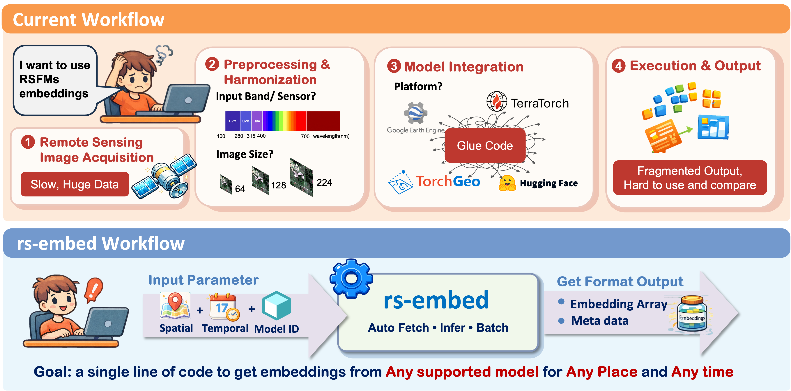

> One line of code to get embeddings from **any Remote Sensing Foundation Model (RSFM)** for **any location** and **any time**

---

## Motivation

The remote sensing community has seen an explosion of foundation models in recent years.
Yet, using them in practice remains surprisingly painful:

- Inconsistent model interfaces: imagery models vs. precomputed embedding products
- Ambiguous input semantics: patch vs. tile vs. grid vs. pooled output
- Large differences in temporal, spectral, and spatial assumptions
- No clean way to benchmark multiple models under one API

RS-Embed aims to fix this.

!!! success "Goal"
    Provide a **minimal**, **unified**, and **stable API** that turns diverse RS foundation models into a simple `ROI → embedding service` — so researchers can focus on **downstream tasks**, **benchmarking**, and **analysis**, not glue code.

---

## Start Here

### Get something running

- [Quickstart](quickstart.md): install the package, run a first example, and learn the three core APIs

### Choose a model

- [Models](models.md): shortlist model IDs by task, input type, and temporal behavior

### Exact signatures

- [API](api.md): exact signatures for specs, embedding, export, and inspection

### Support for a new model

- [Extending](extending.md): add a new model adapter or integrate with the registry/export flow

---

## Why rs-embed

- **Unified interface** for diverse embedding models (on-the-fly models and precomputed products).
- **Spatial + temporal specs** to describe what you want, not how to fetch it.
- **Scale from single regions to massive datasets** built around three functions:

    - `get_embedding(...)`
    - `get_embeddings_batch(...)`   
    - `export_batch(...)`

---

## Common Tasks

| Goal | Page | Main API |
|---|---|---|
| Get one embedding for one ROI | [Quickstart](quickstart.md) | `get_embedding(...)` |
| Compute embeddings for many ROIs | [Quickstart](quickstart.md) | `get_embeddings_batch(...)` |
| Build an export dataset | [Quickstart](quickstart.md) | `export_batch(...)` |
| Compare model assumptions | [Models](models.md) | model tables + detail pages |
| Inspect a raw provider patch | [Inspect API](api_inspect.md) | `inspect_provider_patch(...)` |

---

## Advanced Reading

- [Concepts](concepts.md): deeper semantics for `TemporalSpec`, `OutputSpec`, and backends
- [Workflows](workflows.md): extra task-oriented recipes beyond the quickstart path
- [Advanced Model Reference](models_reference.md): detailed preprocessing and temporal comparison tables
- [Limitations](limitations.md): current constraints and edge cases
