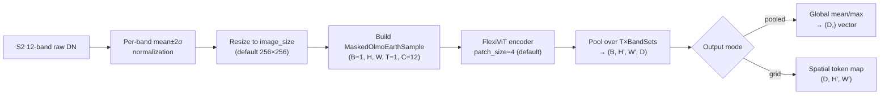
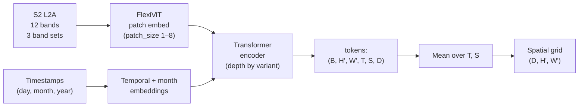

# OlmoEarth (`olmoearth`)

## Quick Facts

| Field                | Value                                                                                                     |
| -------------------- | --------------------------------------------------------------------------------------------------------- |
| Model ID             | `olmoearth`                                                                                               |
| Family / Backbone    | OlmoEarth v1/v1.1 — FlexiViT encoder (ViT-style) trained on the Major TOM dataset                       |
| Adapter type         | `on-the-fly`                                                                                              |
| Model config keys    | `variant` (default: `nano`), `patch_size` (default: `4`), `image_size` (default: `256`)                  |
| Training alignment   | High (S2 L2A 12-band; native 10 m resolution; per-band mean±2σ normalization matches training pipeline)   |

!!! success "OlmoEarth In 30 Seconds"
    OlmoEarth is a **multi-modal geospatial foundation model** from Allen AI, trained on the Major TOM dataset with Sentinel-2 L2A as the primary modality. It uses a FlexiViT encoder that accepts variable patch sizes, enabling flexible spatial resolution trade-offs. In `rs-embed`, the adapter fetches all **12 S2 L2A bands** and encodes them in a single forward pass.

    Key characteristics:
    - All 12 S2 L2A bands in the OlmoEarth band-set order (10 m → 20 m → 60 m groups)
    - Per-band normalization using OlmoEarth's COMPUTED strategy (mean ± 2σ)
    - 4 size variants in v1 (`nano`/`tiny`/`base`/`large`) and 3 in v1.1 (`nano_v1_1`/`tiny_v1_1`/`base_v1_1`)
    - `patch_size` controls the spatial token density (1–8); default `4` matches the official inference example
    - Input image resized to `image_size` (default 256) before encoding
    - Requires `olmoearth-pretrain-minimal` (`pip install rs-embed[olmoearth]`)

---

## Input Contract

| Field                 | Value                                                                              |
| --------------------- | ---------------------------------------------------------------------------------- |
| Backend               | provider only (`gee` / `auto`)                                                     |
| `TemporalSpec`        | `range` or `year` (normalized via shared helper; year → full year composite)       |
| Default collection    | `COPERNICUS/S2_SR_HARMONIZED`                                                      |
| Default bands (order) | `B2, B3, B4, B8, B5, B6, B7, B8A, B11, B12, B1, B9`                              |
| Default fetch         | `scale_m=10`, `cloudy_pct=30`, `composite="median"`                                |
| `input_chw`           | `CHW`, `C=12` in the band order above, raw SR DN `0..10000`                        |
| Side inputs           | timestamps (derived from temporal midpoint), none required from user                |

The band order matches OlmoEarth's internal `Modality.SENTINEL2_L2A` definition:
three band sets (10 m, 20 m, 60 m) totaling 12 channels.

---

## Preprocessing Pipeline



---

## Architecture Concept



The encoder output is a 6-D tensor `(B, H', W', T=1, S, D)` where `S` is the number of band sets (3 for v1, 1 for v1.1 due to the linear patch embedding change). All pooling is applied after the encoder.

---

## Model-specific Settings

### `variant`

Selects the model size and version. Weights are automatically downloaded from Hugging Face on first use.

| Variant      | Version | Encoder Dim | Depth | HuggingFace Repo                   |
| ------------ | ------- | ----------- | ----- | ---------------------------------- |
| `nano`       | v1      | 128         | 4     | `allenai/OlmoEarth-v1-Nano`        |
| `tiny`       | v1      | 192         | 12    | `allenai/OlmoEarth-v1-Tiny`        |
| `base`       | v1      | 768         | 12    | `allenai/OlmoEarth-v1-Base`        |
| `large`      | v1      | 1024        | 24    | `allenai/OlmoEarth-v1-Large`       |
| `nano_v1_1`  | v1.1    | 128         | 4     | `allenai/OlmoEarth-v1_1-Nano`      |
| `tiny_v1_1`  | v1.1    | 192         | 12    | `allenai/OlmoEarth-v1_1-Tiny`      |
| `base_v1_1`  | v1.1    | 768         | 12    | `allenai/OlmoEarth-v1_1-Base`      |

!!! note "v1 vs v1.1 architecture difference"
    v1 uses a Conv2D-based patch embedding, producing 3 separate band-set token groups per spatial location.
    v1.1 uses a linear patch embedding (`use_linear_patch_embed=True`) that merges band sets into a single token stream. Both versions produce the same output dimensionality after pooling.

Short aliases are accepted: `nano_11`, `tiny_11`, `base_11` for v1.1 variants; `nano_v1`, `tiny_v1`, `base_v1`, `large_v1` for v1 variants.

### `patch_size`

Controls the spatial patch size for the FlexiViT encoder. Smaller values produce more spatial tokens (higher resolution) at the cost of longer inference time.

| `patch_size` | Tokens (256×256 image) | Note                              |
| ------------ | ---------------------- | --------------------------------- |
| `4`          | 64 × 64 = 4096         | Default; more spatially detailed  |
| `8`          | 32 × 32 = 1024         | Faster; coarser spatial grid      |
| `2`          | 128 × 128 = 16384      | Very detailed; significantly slower |

### `image_size`

Target pixel size for the resize step. The fetched patch is always resized to `(image_size, image_size)` before encoding. Must be divisible by `patch_size`.

Default: `256` (matching the OlmoEarth training tile size).

---

## Output Semantics

### Pooled (`OutputSpec.pooled()`)

The encoder output `(B, H', W', T=1, S, D)` is pooled over all spatial, temporal, and band-set dimensions via the OlmoEarth built-in `pool_unmasked_tokens()`. This produces a `(D,)` vector.

`pooling="mean"` (default) computes mean; `pooling="max"` computes max over token positions.

### Grid (`OutputSpec.grid()`)

Returns a `(D, H', W')` spatial token map as an `xarray.DataArray` with dimensions `(d, y, x)`. The temporal (T=1) and band-set (S) dimensions are averaged out; only the spatial token grid is retained.

Grid size depends on `image_size` and `patch_size`:
```
H' = W' = image_size // patch_size
```
For defaults (256, patch_size=4): `64 × 64` grid.

---

## Environment Variables

| Variable                         | Default  | Effect                                              |
| -------------------------------- | -------- | --------------------------------------------------- |
| `RS_EMBED_OLMOEARTH_VARIANT`     | `nano`   | Default model variant when `model_config` not given |
| `RS_EMBED_OLMOEARTH_PATCH_SIZE`  | `4`      | Default patch size when `model_config` not given    |
| `RS_EMBED_OLMOEARTH_IMAGE_SIZE`  | `256`    | Default image resize target                         |
| `RS_EMBED_OLMOEARTH_FETCH_WORKERS` | `8`    | Parallel GEE fetch workers for batch calls          |
| `RS_EMBED_OLMOEARTH_BATCH_SIZE`  | `4` (CPU) / `16` (CUDA) | Inference batch size for `get_embeddings_batch_from_inputs` |

---

## Installation

OlmoEarth requires an additional package not included in the base `rs-embed` install:

```bash
pip install rs-embed[olmoearth]
# or
uv pip install olmoearth-pretrain-minimal
```

---

## Usage Examples

```python
import rs_embed as rs
from rs_embed.core.specs import BBox, TemporalSpec, OutputSpec

# Pooled embedding with default nano variant
emb = rs.get_embedding(
    "olmoearth",
    spatial=BBox(minlon=-2.0, minlat=6.0, maxlon=-1.9, maxlat=6.1),
    temporal=TemporalSpec.year(2022),
    output=OutputSpec.pooled(),
)
print(emb.data.shape)   # (128,) for nano

# Use base variant
emb_base = rs.get_embedding(
    "olmoearth",
    spatial=BBox(minlon=-2.0, minlat=6.0, maxlon=-1.9, maxlat=6.1),
    temporal=TemporalSpec.year(2022),
    output=OutputSpec.pooled(),
    model_config={"variant": "base"},
)
print(emb_base.data.shape)   # (768,) for base

# Grid embedding (spatial token map)
emb_grid = rs.get_embedding(
    "olmoearth",
    spatial=BBox(minlon=-2.0, minlat=6.0, maxlon=-1.9, maxlat=6.1),
    temporal=TemporalSpec.year(2022),
    output=OutputSpec.grid(),
    model_config={"variant": "nano", "patch_size": 8},
)
print(emb_grid.data.shape)   # (128, 32, 32) for nano with patch_size=8

# Class-based API for repeated calls
from rs_embed.model import Model
from rs_embed.core.specs import PointBuffer

model = Model("olmoearth", model_config={"variant": "tiny"})
embeddings = model.get_embeddings_batch([
    PointBuffer(lon=-1.95, lat=6.05, buffer_m=1000),
    PointBuffer(lon=-2.10, lat=6.20, buffer_m=1000),
], temporal=TemporalSpec.year(2022))
```

---

## Notes and Caveats

- The OlmoEarth normalizer clips to `mean ± 2σ` before rescaling to `[0, 1]`. Values outside this range are clipped, not discarded.
- `patch_size` is a **model input** (FlexiViT accepts variable patch sizes), not a preprocessing hyperparameter. Different `patch_size` values may produce embeddings with different spatial characteristics.
- The `large` variant is only available in v1 (no v1.1 large release at time of writing).
- Weights are cached by `huggingface_hub` in the default HF cache directory.
